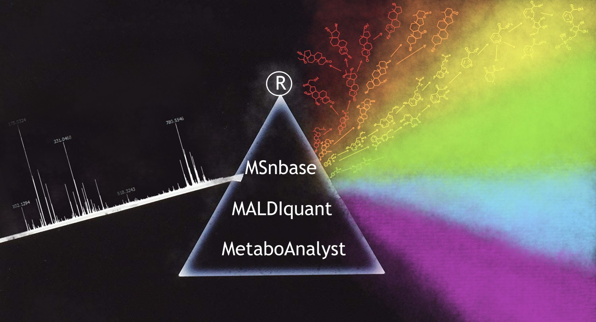

<h1 align="center">An-OpenSource-Pipeline-for-Processing-Direct-Infusion-Mass-Spectrometry-Data</h1>

<h2 align="center">

<i>Every year is getting shorter, never seem to find the time,</i>

<i>Plans that either come to naught or half a page of scribbled lines.</i>

</h2>
<h3 align="right"><i>Pink Floyd</i></h3>

## Description

The entire pipeline was built on the publicly available R language packages most commonly used to process, analyze and visualize mass spectrometry data (MSnbase, MALDIquant and MetaboAnalyst). 
Bioinformaticians can now reanalyze the direct infusion mass spectra without access to commercial software.

## Input format

Before processing your data should be converted into mzML or mzXML with MSconvert (a part of ProteoWizard, can be downloaded here: https://proteowizard.sourceforge.io/download.html )

