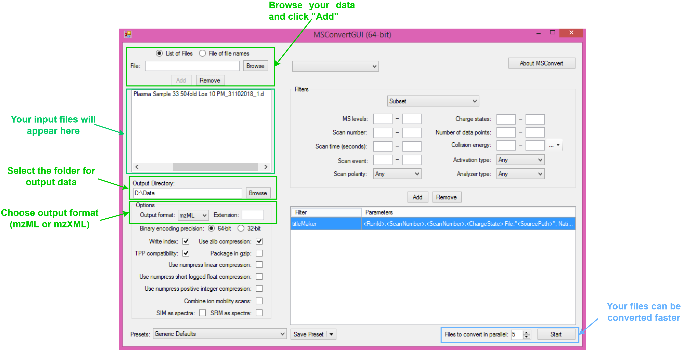

<h1 align="center">An-OpenSource-Pipeline-for-Processing-Direct-Infusion-Mass-Spectrometry-Data</h1>

<h2 align="center">
<p align="right"><i>Every year is getting shorter, never seem to find the time,</i></p>
<p align="right"><i>Plans that either come to naught or half a page of scribbled lines.</i></p>
</h2>
<h3 align="right"><i>Pink Floyd</i></h3>


## Description

The entire pipeline was built on the publicly available R language packages most commonly used to process, analyze and visualize mass spectrometry data (MSnbase, MALDIquant and MetaboAnalyst). 
Bioinformaticians can now reanalyze the direct infusion mass spectra (DIMS) without access to commercial software.

## Requirements

Make sure that your R version >= 4.0.
<p>MSnbase can be installed via Bioconductor:</p>

```R
BiocManager::install("MSnbase")
```

<p>MALDIquant and MALDIquantForeign can be installed with next code:</p>

```R
install.packages(c("MALDIquant", "MALDIquantForeign"))
```

<p>Detailed instructions for installing MetaboAnalystR are on the developer's page: https://github.com/xia-lab/MetaboAnalystR</p>
<p>If you are a Linux user, then make sure you have the following packages:</p>
<p><span>&#8226;</span> libxml2-dev</p>
<p><span>&#8226;</span> libnetcdf-dev</p>
<p><span>&#8226;</span> libmagick++-dev</p>
<p><span>&#8226;</span> libcurl4-openssl-dev</p>
<p><span>&#8226;</span> libssl-dev</p>

## Input format

Before processing your data should be converted into mzML or mzXML with MSconvert (a part of ProteoWizard, can be downloaded here: https://proteowizard.sourceforge.io/download.html )



## Make the consensus mass spectum

If your .mzML files contain > 1 spectra, then a consensus spectrum should be obtained. Use the MSnbase package in your RStudio IDE.
<p>For example:</p>

```R
library("MSnbase")
library("foreach")
library("parallel")
library("doParallel")
library("iterators")

file.prof <- "/path/to/your/files/"

# make consensus spectra with parallel
myCluster <- makeCluster(4, type="FORK")
registerDoParallel(myCluster)
foreach(i=1:length(file.prof)) %dopar% {
  pf <- readMSData(file.prof[i], pdata = NULL, mode = "onDisk")
  spec <- MSpectra(spectra(pf))
  cons.spec <- combineSpectra(spec, timeDomain = F, mzd = 0.001, ppm = 1, weighted = TRUE)
  writeMSData(object = as(cons.spec, "MSnExp"), file = paste0("/your/path/to/consensus/spectra/", basename(file.prof[i])))
}
stopCluster(myCluster)
```

<p>MSnbase documentation: https://www.bioconductor.org/packages/devel/bioc/manuals/MSnbase/man/MSnbase.pdf</p>

## Processing consensus spectra with MALDIquant

MALDIquant was originally developed for processing MALDI mass spectra. There is some superficial similarity between the MALDI spectrum and DIMS as shown in the figure below. Thus, the MALDIquant can be used to process direct infusion mass spectra with a standard pipeline for MALDI data.


<p>The standard processing mass spectrometry data with MALDIquant package:</p>

```R

library("MALDIquantForeign")
library("MALDIquant")

# Import your consensus spectra with parallel (the function from MALDIquantForeign package)
mzml <- importMzMl("/your/directory/consensus/spectra", centroided=FALSE, mc.cores=4,
                     verbose=FALSE)

# Set the method to transform intensities
t_spec <- transformIntensity(mzml, method="sqrt")

# Smoothing intensities with Savitzky-Golay method
smooth_spec <- smoothIntensity(t_spec, method="SavitzkyGolay", halfWindowSize=4)

# Set the method for baseline correction and number of iterations
bsln_off_spec <- removeBaseline(smooth_spec, method="SNIP", iterations=80)

# Make the spectra alignment
align_spec <- alignSpectra(bsln_off_spec, halfWindowSize=2, noiseMethod="MAD", SNR=1,
                         tolerance=0.001, warpingMethod="lowess")

# Detect peaks with noise filtering method "median absolute deviation"
my_peaks <- detectPeaks(align_spec, method="MAD", halfWindowSize=4, SNR=1)

# Make peak bins (all aligned peaks will have the same m/z values)
my_peaks <- binPeaks(my_peaks, method="strict", tolerance=0.001)
```
my_peaks is the R list with all processed mass spectra. Each element of the list is the processed consensus mass spectrum from the sample.

<p>More information about MALDIquant and MALDIquantForeign on developer's GitHub: https://strimmerlab.github.io/software/maldiquant/</p>

## Export the peak lists with artifical p-value for Mummichog annotation

For further processing steps you have to export your peak lists into files (e. g.):

<table>
  <tr>
    <th>"m.z"</th>
    <th>"p.value"</th>
  </tr>
  <tr>
    <td>86.15466</td>
    <td>0.99</td>
  </tr>
  <tr>
    <td>87.12934</td>
    <td>0.99</td>
  </tr>
  <tr>
    <td>88.23249</td>
    <td>0.99</td>
  </tr>
  <tr>
    <td>...</td>
    <td>...</td>
  </tr>
</table>


